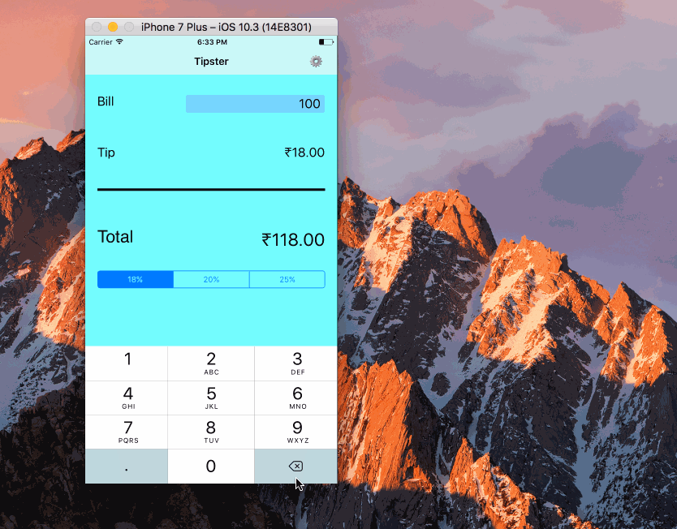

# Pre-work - *Tipster*

Tipster is a tip calculator application for iOS.

Submitted by: Apurva Mehta

Time spent: 4 hours spent in total

## User Stories

The following **required** functionality is complete:

* [X] User can enter a bill amount, choose a tip percentage, and see the tip and total values.
* [X] Settings page to change the default tip percentage.

The following **optional** features are implemented:
* [ ] UI animations
* [ ] Remembering the bill amount across app restarts (if <10mins)
* [X] Using locale-specific currency and currency thousands separators.
* [X] Making sure the keyboard is always visible and the bill amount is always the first responder. This way the user doesn't have to tap anywhere to use this app. Just launch the app and start typing.

The following **additional** features are implemented:

* [X] Made some minor color/font modifications.

## Video Walkthrough 

Here's a walkthrough of implemented user stories:

(Tipster2.gif)

GIF created with [LiceCap](http://www.cockos.com/licecap/).

## Project Analysis

As part of your pre-work submission, please reflect on the app and answer the following questions below:

**Question 1**: "What are your reactions to the iOS app development platform so far? How would you describe outlets and actions to another developer? Bonus: any idea how they are being implemented under the hood? (It might give you some ideas if you right-click on the Storyboard and click Open As->Source Code")

**Answer:**
iOS development is pretty easy and straightforward, however mastery will take a lot of hardwork and time
to understand all the frameworks.
 Outlets -> Displays results/updates on the UI.
 Action  -> A function that gets executed on user interaction to a UI element.
 Outlets/Actions seem to implemented as XML tags/elements with appropriate properties set for execution.

Question 2: "Swift uses [Automatic Reference Counting](https://developer.apple.com/library/content/documentation/Swift/Conceptual/Swift_Programming_Language/AutomaticReferenceCounting.html#//apple_ref/doc/uid/TP40014097-CH20-ID49) (ARC), which is not a garbage collector, to manage memory. Can you explain how you can get a strong reference cycle for closures? (There's a section explaining this concept in the link, how would you summarize as simply as possible?)"

**Answer:**
[Reference: https://www.raywenderlich.com/134411/arc-memory-management-swift]
If a closure is assigned to the property of a class, and that closure uses instance properties of that same class, you have a reference cycle.

Tipster was tested on the iPhone 7 Plus Simulator and the iPhone 7 Plus Hardware.

## License

Copyright [2017] [Apurva Mehta]

Licensed under the Apache License, Version 2.0 (the "License");
you may not use this file except in compliance with the License.
You may obtain a copy of the License at

http://www.apache.org/licenses/LICENSE-2.0

Unless required by applicable law or agreed to in writing, software
distributed under the License is distributed on an "AS IS" BASIS,
WITHOUT WARRANTIES OR CONDITIONS OF ANY KIND, either express or implied.
See the License for the specific language governing permissions and
limitations under the License.
